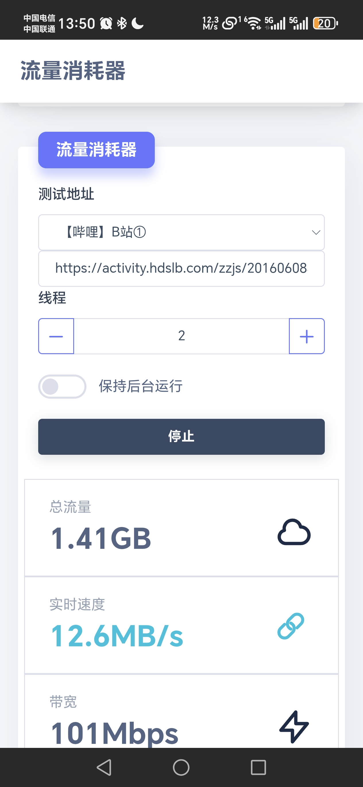
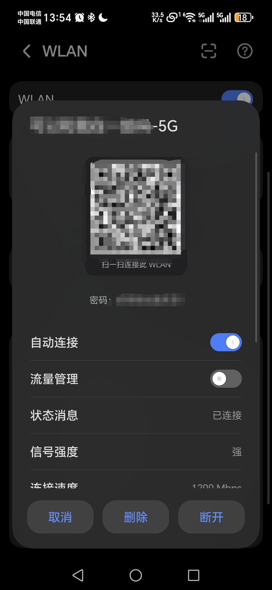
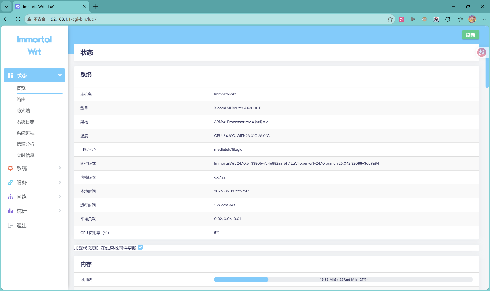
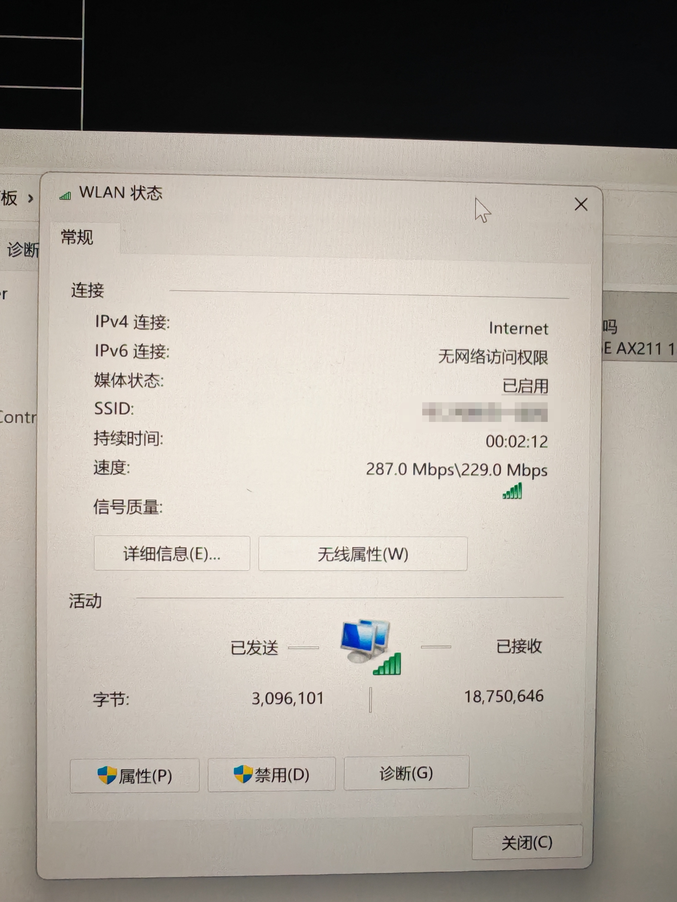
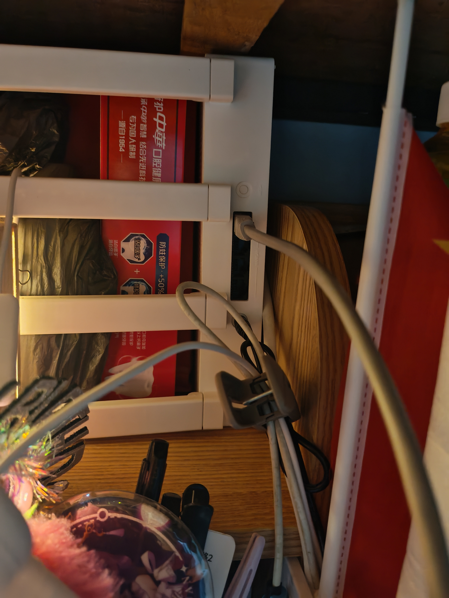

# 校园网总是很慢？你想拥有更快的网速吗？—— 路由器折腾记录

> **主渠道**：QQ 校园频道 + 抖音（同等重要）
> **次渠道**：小红书
> **定价**：全套 ¥150（路由器 + 刷机 + 配置 + 测试 + 教你用），四人平摊每人 ¥37.5，每月每人不到 ¥10

---

## 一、QQ 校园频道版（正式版）

---

### 📡 路由器实物

**校园网一个账号只能一台设备登录，宿舍四个人就要买四张卡。我花了一周折腾了一台路由器，把四个人的校园网合并成了一套，开机自动上网，网速跑满百兆，每月每人不到 10 块。**

我花了一周，从零折腾了一台小米 AX3000T 路由器，刷了开源固件，让一个账号四台设备同时用。

---

### ⚡ 实测网速

实测下载速度 **12.8MB/s**，一秒下载一首歌，三秒下载一集电视剧。

四个人同时用，刷视频、打游戏、看直播，互不影响。

---

### 📱 连上就能用

连上就能用，不用每次打开浏览器手动登录。

---

### 🔧 踩过的坑

折腾过程中踩了不少坑：

| 问题 | 状态 |
|------|------|
| 设备重连会断网 | ✅ 已修复 |
| 断网恢复要 20 秒 | ✅ 优化到 1 秒 |
| 校园内部网站打不开 | ✅ 修复了 DNS |
| 一个人下载全宿舍卡 | ✅ 搞定了智能带宽分配 |
| 广告太多 | ✅ 18 万域名自动屏蔽 |

---

### 📊 稳定性验证

14 个站点 × 30 轮压力测试，全部通过。

---

### 🔌 有线扩展

网卡设备可以直接插网线，台式机也能用。

---

### 📶 WiFi6 极速连接

WiFi6 协议，连接速率 **1200Mbps**，实际跑满校园网百兆带宽。

比普通 WiFi5 路由器快 2.4 倍，信号更强，穿墙更好，多人同时连接不卡顿。

四根天线，5GHz + 2.4GHz 双频并发，宿舍每个角落都有信号。

---

### ✅ 最终能做到的事

| 功能 | 说明 |
|------|------|
| 🎯 一个账号四台设备同时用 | 突破一账号一设备限制 |
| 🔌 插电就能用 | 你不需要操心任何东西 |
| 💰 四人共用 | 每月每人不到 10 块 |
| 🚀 开机自动认证 | 不用手动登录 |
| ⚡ 百兆跑满 | 智能分配带宽 |
| 🎮 一人下载不影响其他人 | 打游戏不卡 |
| 🔄 断网 1 秒自动恢复 | 你甚至感觉不到 |
| 🚫 广告屏蔽 | 全设备自动生效 |
| 📚 教务系统、图书馆正常访问 | 校园内部网站无障碍 |
| 🔗 网卡设备可以插网线 | 台式机也能用 |
| 🏠 2.4G 频段支持智能家居 | 智能灯、音箱、插座 |

---

**有需要的同学可以私我哦~😘**

---

---

## 二、抖音版（图文/视频通用）

---

### 封面

> 大字标注：**宿舍四人共用校园网 | 每月每人不到10块**

---

### 标题

`校园网总是很慢？你想拥有更快的网速吗？-路由器折腾记录`

---

### 正文

校园网一个账号只能一台设备登录，宿舍四个人就要买四张卡，每月话费加起来一百多。

我花了一周，从零折腾了一台路由器，让一个账号四台设备同时用，开机自动上网。

实测下载速度 **12.8MB/s**——一秒下载一首歌，三秒下载一集电视剧。

四个人同时用，刷视频、打游戏、互不影响。

---

连上就能用，不用每次打开浏览器登录。

---

折腾过程中踩了不少坑：

| 问题 | 状态 |
|------|------|
| 设备重连断网 | ✅ 已修复 |
| 断网恢复慢 | ✅ 优化到 1 秒 |
| 校园网站打不开 | ✅ 修了 DNS |
| 一人下载全宿舍卡 | ✅ 智能带宽分配 |
| 广告多 | ✅ 18 万域名自动屏蔽 |

---

---

✅ 一个账号四台设备同时用
✅ 插电就能用，不需要操心任何东西
✅ 四人共用，每月每人不到 10 块
✅ 开机自动认证
✅ 百兆跑满，智能分配带宽
✅ 一人下载不影响其他人
✅ 断网 1 秒自动恢复
✅ 广告屏蔽，全设备生效
✅ 教务系统、图书馆正常访问
✅ 网卡设备插网线
✅ 2.4G 支持智能家居

---

**有需要的同学可以私我哦~😘**

#校园网 #路由器 #大学生省钱 #宿舍神器 #WiFi6 #河大 #开学必备 #校园生活

---

---

## 三、小红书版（技术记录风格）

---

### 标题

`校园网总是很慢？你想拥有更快的网速吗？-路由器折腾记录`

---

### 文首

**我花了一周，把一台小米路由器改成了宿舍的"私人基站"。四个人共用一个校园网账号，开机自动上网，网速跑满百兆，广告自动屏蔽，四人平摊每人每月不到 10 块。**

---

### 四个痛点

- 校园网一个账号只能一台设备登录，宿舍四个人就要买四张卡？
- 每次连校园网，都要打开浏览器手动点登录，过几个小时还得重新来？
- 每月话费四张卡加起来一百多？
- 网速慢、动不动就断、一个人下东西全宿舍都卡？

**我全遇到了。于是我买了一台路由器，花了一周从零折腾，把这些问题全解决了。**

---

### Day 1 — 从零到可用

路由器到手，先刷开源固件，然后一步步配置：

连校园网 → 写自动认证脚本 → 配置智能流控 → 写监控工具

从早上 8 点干到晚上 11 点，13 个小时。

第一天搞完，四个人连上就能用了。

**但第二天就出了问题。**

---

### Day 2 — 设备重连全网断

室友的手机重新连 WiFi，所有设备瞬间断网。

挂机游戏弹"网络异常"，全宿舍炸锅。

排查了半天，发现是芯片冲突——部分设备连入时，路由器被迫重启无线模块，全网断。

修了 6 个地方：频宽对齐、信道锁定、路由看门狗、认证脚本升级、定时优化、开机自启。

好了很多，但断网恢复还是太慢——要等 20 秒。

**打一局游戏 20 秒断网，够死三次了。**

---

### Day 3 — 秒级恢复

把看门狗从"每 20 秒检测一次"改成"每秒检测"的守护进程。

听起来简单，踩了 9 个坑。

最离谱的一个：`wifi reload` 会把所有设备踢掉——本来想修一个人的断网，结果四个人全断了。

改成只重连指定信道，问题解决。

**最终：断网 1-2 秒自动恢复。你甚至感觉不到断过。**

同一天还修了校园内部网站。

教务系统、图书馆、学工系统——校园网的 DNS 对这些域名解析有问题，有的打不开。

研究了半天，发现两个 DNS 服务器各有盲区。解决方案：不同域名走不同的 DNS，再加 hosts 文件写死。

---

### Day 4 — 监控 + 智能家居

加了流量监控、性能监控、广告屏蔽、VPN、NTP 时间同步。

另外，路由器有 2.4G 和 5G 两个频段。

5G 负责上网主力，跑满百兆。

**2.4G 独立出来接智能家居——智能灯、智能音箱、智能插座，全连 2.4G，不影响 5G 速度。**

宿舍秒变智能宿舍。

---

### Day 5 — 继续打磨

WiFi6 协议，连接速率 **1200Mbps**，实际跑满校园网百兆带宽。

比普通 WiFi5 路由器快 2.4 倍，信号更强，穿墙更好，多人同时连接不卡顿。

发现一个域名间歇性解析失败，又修了 hosts 文件。

到现在稳定运行好几天，四个人同时用没问题。

---

### 智能带宽分配

这套系统最让我满意的一点：

**一个人跑满速下载，另外三个人打游戏、看视频，不受影响。**

以前一个人下东西全宿舍卡，现在各用各的。

---

### 最终效果

✅ 一个账号四台设备同时用，突破一账号一设备限制
✅ 插电就能用，不需要操心任何东西
✅ 开机自动认证，不用手动登录
✅ 四人共用，智能流控不抢网速
✅ 百兆跑满
✅ 断网 1-2 秒自动恢复
✅ 一人下载不影响其他人
✅ 广告屏蔽，18 万域名全设备生效
✅ 教务系统、图书馆正常访问
✅ 网卡设备插网线
✅ 2.4G 支持智能家居
✅ 流量监控，每设备统计
✅ 性能监控，CPU/内存/延迟图表
✅ 5G 上网 + 2.4G 智能家居
✅ VPN 远程访问，硬件加速
✅ 完整教程 + 开发日志 + 一键脚本

---

### 踩坑记录

| 问题 | 解决方案 |
|------|----------|
| 设备重连全网断 | 频宽对齐 + 信道锁定 |
| 看门狗 20 秒太慢 | 改成每秒检测的守护进程 |
| 重载无线踢掉所有人 | 改成只重连指定信道 |
| 校园网站打不开 | 不同域名走不同 DNS + hosts 写死 |
| 部分域名间歇失败 | hosts 写死 IP |
| 守护进程挂了不会重启 | 系统级进程管理 + 自动恢复 |
| DNS 重启影响其他服务 | 加延迟保护 |

**你踩过的坑，别人不用再踩。**

---

**有需要的同学可以私我哦~😘**

#校园网 #路由器 #大学生省钱 #宿舍神器 #小米路由器 #WiFi6 #河大 #校园生活 #智能家居 #开学必备
